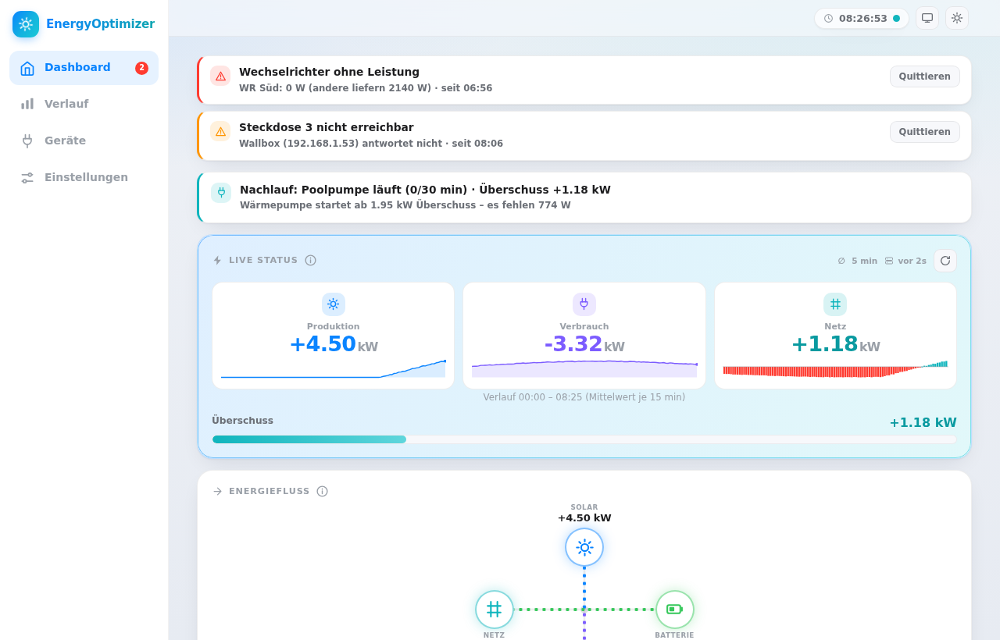
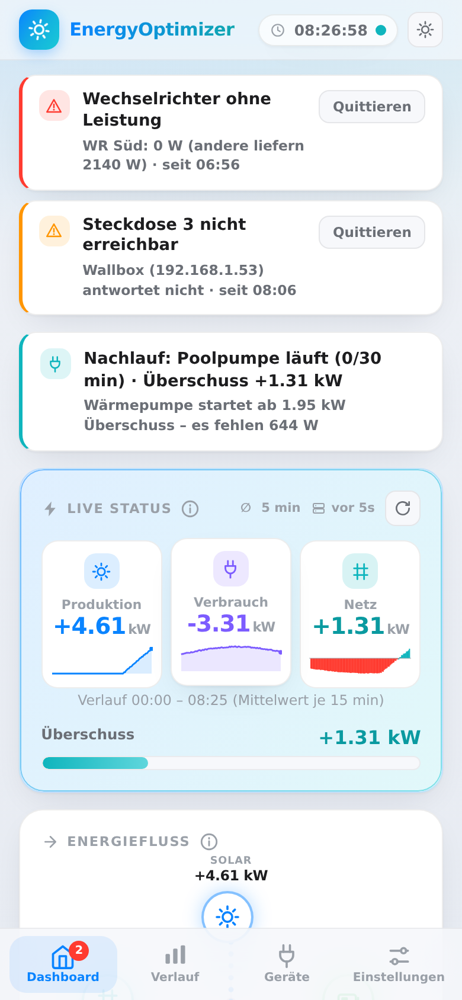
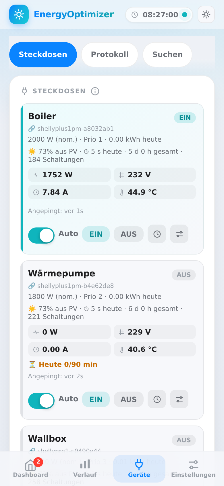

<p align="center">
  
</p>

<h1 align="center">EnergyOptimizer</h1>

<p align="center">
  Put your solar surplus to use instead of exporting it: EnergyOptimizer reads your Solar-Log and
  switches Shelly plugs and MQTT loads on and off automatically.
</p>

<p align="center">
  <a href="https://github.com/officialminx/EnergyOptimizer/actions/workflows/docker.yml"></a>
  <a href="https://github.com/officialminx/EnergyOptimizer/releases"></a>
  
  <a href="LICENSE"></a>
</p>

<p align="center">
  
</p>

## Features

- **Surplus control:** switches up to four Shelly plugs (Gen2/Gen3) and four external MQTT switches by priority, with hysteresis, minimum on/off times and a reserve buffer.
- **Solar-Log integration:** reads the password-protected JSON API, including battery, inverter and device-level data.
- **Battery guard:** holds loads back while the home battery is discharging.
- **Schedules and limits:** time windows, weekly programs, a minimum daily runtime with a bad-weather fallback, daily caps and timed manual overrides.
- **Energy tracking:** daily and lifetime counters per plug with PV share, 15-minute history, a daily archive and CSV export.
- **Alerts:** push notifications via [ntfy](https://ntfy.sh) for outages, unreachable plugs and inverter faults, plus a heartbeat for external monitoring.
- **Home Assistant:** MQTT with auto-discovery.
- **Mobile-first UI:** installable as a home-screen web app on iPhone and Android, with light and dark mode and a kiosk view for wall displays.

<p align="center">
  
  &nbsp;
  
</p>

## Requirements

- A Solar-Log with its web interface reachable on your network.
- Shelly Plus/Pro plugs or relays (Gen2 or newer), or loads you control over MQTT.
- A Raspberry Pi 3, 4 or 5 with **64-bit** Raspberry Pi OS, or any other Linux host with Docker (arm64 or amd64).

## Quick start

Install Docker on the Raspberry Pi:

```sh
curl -fsSL https://get.docker.com | sh
sudo usermod -aG docker $USER   # log out and back in afterwards
```

Download the compose file and start EnergyOptimizer:

```sh
mkdir -p ~/energyoptimizer && cd ~/energyoptimizer
curl -fsSLO https://raw.githubusercontent.com/officialminx/EnergyOptimizer/main/docker-compose.yml
docker compose up -d
```

Open **http://energyoptimizer.local** in your browser. On first start, EnergyOptimizer asks you
to set a password for the web interface. Then enter your Solar-Log address and password under
**Einstellungen → SolarLog** and add your plugs under **Geräte**.

> The `.local` name is announced over mDNS. If your network doesn't resolve it, use the IP
> address of the Raspberry Pi instead. You can change the name under
> **Einstellungen → Netzwerk**.

## Updating

```sh
cd ~/energyoptimizer
docker compose pull && docker compose up -d
```

The web interface shows a notice when a new release is available. Settings, history and
counters live in the `./data` folder and are kept across updates.

## Forgot your password?

Run this on the Raspberry Pi, in the folder that contains `docker-compose.yml`:

```sh
docker compose exec energyoptimizer python -m energyoptimizer reset-password
```

Reload the web interface within a few seconds and set a new password. All other settings stay
unchanged.

## Remote access with Tailscale

EnergyOptimizer has no built-in cloud access. To reach it on the go, install
[Tailscale](https://tailscale.com/download/linux) on the Raspberry Pi and on your phone:

```sh
curl -fsSL https://tailscale.com/install.sh | sh
sudo tailscale up
sudo tailscale serve --bg 80
```

`tailscale serve` publishes the web interface with a valid HTTPS certificate at
`https://<pi-name>.<your-tailnet>.ts.net`, reachable only from devices in your tailnet (enable
MagicDNS and HTTPS certificates in the Tailscale admin console first). Open that address in
Safari and choose **Share → Add to Home Screen** to use it like an app.

`energyoptimizer.local` only resolves on your home network. Over Tailscale, use the Tailscale
name of the Raspberry Pi instead.

## Backup and migration

Everything is stored in `./data`: settings, energy counters, history, the daily archive, the
event log and notes. Copying this folder is a complete backup.

To move a configuration from another installation, export it under
**Einstellungen → Daten & Sicherung → Konfiguration sichern** and import it on the new one.
Passwords and the ntfy topic are not included in the export and need to be entered again.

## Configuration

Almost everything is configured in the web interface. A few options are set as environment
variables in `docker-compose.yml`:

| Variable | Default | Description |
|---|---|---|
| `TZ` | `Europe/Zurich` | Time zone for schedules, time windows and the daily rollover |
| `EO_PORT` | `80` | Port of the web interface |
| `EO_BIND` | `0.0.0.0` | Address the web server listens on |
| `EO_DATA_DIR` | `/data` | Data folder inside the container |
| `EO_LOG_LEVEL` | `INFO` | Set to `DEBUG` to log every Solar-Log request |
| `EO_HOSTNAME` | `energyoptimizer` | Network name on first start (later: **Einstellungen → Netzwerk**) |
| `EO_MDNS` | `1` | Set to `0` to disable the `.local` announcement |
| `EO_UPDATE_CHECK` | `1` | Set to `0` to disable the check for new releases on GitHub |
| `EO_SCAN_SUBNET` | host subnet | Subnet for Shelly discovery, e.g. `192.168.1.0/24` |
| `EO_HOST_IP` | auto | IP address shown in the web interface and announced over mDNS |
| `EO_SOLARLOG_HOST` | – | Solar-Log address, applied on first start only |
| `EO_SOLARLOG_PORT` | – | Solar-Log port, applied on first start only |
| `EO_SOLARLOG_PASSWORD` | – | Solar-Log password, applied on first start only |
| `EO_WEB_PASSWORD` | – | Web interface password, applied on first start only |

If port 80 is already in use on the host, set `EO_PORT` to another port, for example `8080`,
and open `http://energyoptimizer.local:8080`.

## How the Solar-Log connection works

The Solar-Log only answers password-protected JSON requests that follow its own login flow.
EnergyOptimizer uses the same client as
[ha-advanced-solarlog](https://github.com/officialminx/ha-advanced-solarlog):

1. `POST /getjp` with `Content-Type: text/html` and `X-SL-CSRF-PROTECTION: 1`.
2. Log in via `POST /login`, trying the `user`, `installer`, `installateur` and `pm` accounts.
3. If the Solar-Log reports a wrong password, retry with the bcrypt hash of the password and the
   device's salt (required by newer Solar-Log firmware).
4. Send the `SolarLog` session cookie with every request, and log in again on `ACCESS DENIED`.

The raw Solar-Log response and the account that logged in are shown under
**Einstellungen → SolarLog → Diagnose (Rohantwort)**.

## Development

```sh
cd app
pip install -r requirements-dev.txt
python -m pytest
EO_DATA_DIR=/tmp/eo EO_PORT=8080 python -m energyoptimizer
```

The tests run against a simulated Solar-Log that, like the real device, only answers with
the cookie login, the CSRF header and a bcrypt-hashed password. Append `?demo=1` to the URL
to preview the interface with sample data.

Container images for `linux/arm64` and `linux/amd64` are built by GitHub Actions and
published to `ghcr.io/officialminx/energyoptimizer`: `latest` from `main`, and a version tag
for every `v*` release.

## License

[Apache License 2.0](LICENSE)
