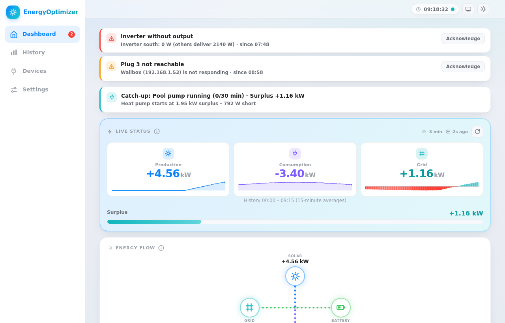
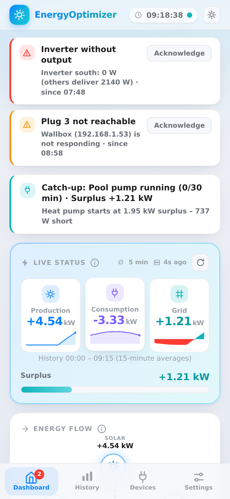
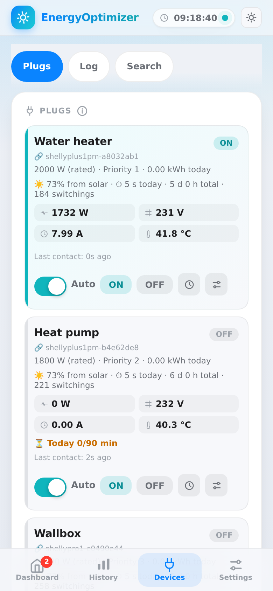

<p align="center">
  
</p>

<h1 align="center">EnergyOptimizer</h1>

<p align="center">
  Put your solar surplus to use instead of exporting it: EnergyOptimizer reads your Solar-Log,
  Fronius inverter, Shelly energy meter, Modbus inverter or MQTT values and switches Shelly plugs
  and MQTT loads on and off automatically.
</p>

<p align="center">
  <a href="https://github.com/officialminx/EnergyOptimizer/actions/workflows/docker.yml"></a>
  <a href="https://github.com/officialminx/EnergyOptimizer/releases"></a>
  
  <a href="LICENSE"></a>
</p>

<p align="center">
  
</p>

## Features

- **Surplus control:** switches up to 16 Shelly plugs (Gen2/Gen3) and 16 external MQTT switches by priority, with hysteresis, minimum on/off times and a reserve buffer. Presets (cautious, balanced, aggressive) set sensible values in one click.
- **Data sources:** Solar-Log (password-protected JSON API with battery and inverter data), Fronius Solar API, Shelly Pro 3EM / Pro EM / 3EM at the grid connection (optionally a second Shelly on the PV line), Modbus TCP with presets for SMA and Huawei SUN2000 or registers of your own (experimental), or values from any MQTT topics. Poll intervals are set in seconds.
- **What is it doing?** The dashboard lists every load with what it is doing and why ("waiting for 1.95 kW surplus – 723 W missing", "running on surplus for 30 min", "locked for 3 min after switching off").
- **Dry run and simulation:** a dry run lets the automatic decide without switching anything; a simulation replays any past day with other buffers and lock times and shows how much more surplus would have been used.
- **Battery guard:** holds loads back while the home battery is discharging. Surplus goes to the loads first, because charging and discharging a battery loses energy.
- **Schedules and limits:** time windows, weekly programs, a minimum daily runtime with a bad-weather fallback, daily caps and timed manual overrides.
- **Energy tracking:** daily and lifetime counters per plug with PV share and the learned typical power, 15-minute history, any past day from the long-term log, a daily archive, self-consumption and self-sufficiency rates, savings and CSV export.
- **Monitoring:** detects outages of the data source, unreachable plugs, external switches that do not confirm a command (state topic) and inverter faults and shows them on the dashboard, plus a heartbeat ping for external uptime monitors.
- **Home Assistant:** MQTT auto-discovery with the same entities as the [ha-energyoptimizer](https://github.com/officialminx/ha-energyoptimizer) integration, including a master switch.
- **German and English:** pick the interface language in the settings; a setup wizard guides you through the first start.
- **Mobile-first UI:** installable as a home-screen web app on iPhone and Android, with light and dark mode, compact device rows that expand on tap, keyboard focus and screen-reader labels, and a kiosk view for wall displays.
- **Sign-in sessions:** each signed-in device has its own token and can be signed out on its own, or all at once.

<p align="center">
  
  &nbsp;
  
</p>

## Requirements

- A source for production and consumption on your network: a Solar-Log, a Fronius inverter with Smart Meter, a Shelly energy meter at the grid connection, an SMA or Huawei inverter with Modbus TCP, or the values in MQTT.
- Shelly Plus/Pro plugs or relays (Gen2 or newer), or loads you control over MQTT.
- A Raspberry Pi 3, 4 or 5 with **64-bit** Raspberry Pi OS, or any other Linux host with Docker (arm64 or amd64).

## Quick start

Install Docker on the Raspberry Pi:

```sh
curl -fsSL https://get.docker.com | sh
sudo usermod -aG docker $USER   # log out and back in afterwards
```

Download the compose file and start EnergyOptimizer:

```sh
mkdir -p ~/energyoptimizer && cd ~/energyoptimizer
curl -fsSLO https://raw.githubusercontent.com/officialminx/EnergyOptimizer/main/docker-compose.yml
docker compose up -d
```

Open **http://energyoptimizer.local** in your browser. On first start, EnergyOptimizer asks you
to choose German or English and to set a password for the web interface. A short setup wizard
then connects your Solar-Log, finds your Shelly plugs and sets the network name. Other data
sources are chosen under **Settings → Data source**. Everything can
be changed later under **Settings**; the wizard can be run again under
**Settings → Language & setup**.

> The `.local` name is announced over mDNS. If your network doesn't resolve it, use the IP
> address of the Raspberry Pi instead. You can change the name under
> **Settings → Network**.

## Updating

EnergyOptimizer checks GitHub for a new release once a week, and you can check at any time with
**Settings → Update & info → Check for updates now**. When a new release is available, the web
interface shows a notice with an **Install** button. It downloads the new image and replaces the
container; the page reloads by itself after about a minute. If the new version does not start, the
old container is restored. Settings, history and counters live in the `./data` folder and are kept
across updates.

This needs the Docker socket in `docker-compose.yml` (the line
`/var/run/docker.sock:/var/run/docker.sock`, already included in the file in this repository). The
socket gives full control over Docker on the host. If you would rather not mount it, remove that
line and update from the command line instead:

```sh
cd ~/energyoptimizer
docker compose pull && docker compose up -d
```

Installations from before v0.1.1 have to add the socket line to their `docker-compose.yml` and update
once with the command above; after that the button works.

## Forgot your password?

Run this on the Raspberry Pi, in the folder that contains `docker-compose.yml`:

```sh
docker compose exec energyoptimizer python -m energyoptimizer reset-password
```

The command asks for the new password twice. A few seconds later it applies and you can sign in
with it; the web interface is protected the whole time. All other settings stay unchanged.

EnergyOptimizer stores only a salted scrypt hash of the password. After five wrong attempts the
login locks for one second, and each further wrong attempt doubles the lock, up to 15 minutes.
A password reset signs out every device; **Settings → Security** lists the signed-in devices
and signs out single ones.

## Remote access with Tailscale

EnergyOptimizer has no built-in cloud access. To reach it on the go, install
[Tailscale](https://tailscale.com/download/linux) on the Raspberry Pi and on your phone:

```sh
curl -fsSL https://tailscale.com/install.sh | sh
sudo tailscale up
sudo tailscale serve --bg 80
```

`tailscale serve` publishes the web interface with a valid HTTPS certificate at
`https://<pi-name>.<your-tailnet>.ts.net`, reachable only from devices in your tailnet (enable
MagicDNS and HTTPS certificates in the Tailscale admin console first). Open that address in
Safari and choose **Share → Add to Home Screen** to use it like an app.

`energyoptimizer.local` only resolves on your home network. Over Tailscale, use the Tailscale
name of the Raspberry Pi instead.

## Home Assistant

EnergyOptimizer announces itself to Home Assistant over MQTT. Set up the
[MQTT integration](https://www.home-assistant.io/integrations/mqtt/) in Home Assistant, then enter
the same broker under **Settings → MQTT / Home Assistant** and leave **Home Assistant discovery**
on. The entities match the [ha-energyoptimizer](https://github.com/officialminx/ha-energyoptimizer)
integration, so dashboards and automations work with either:

| Device | Entity | Meaning |
| --- | --- | --- |
| EnergyOptimizer | Available surplus | Production minus consumption, the power the control distributes |
| EnergyOptimizer | Managed load | Power of the loads the optimizer switched on |
| EnergyOptimizer | Optimizer (switch) | Master switch; off leaves every load as it is |
| EnergyOptimizer | Readings stale | The Solar-Log readings stopped arriving |
| EnergyOptimizer | Battery has priority | The home battery is discharging, loads are held back |
| Each plug | Status | `off`, `waiting`, `surplus`, `catchup`, `manual`, `blocked`, `disabled`, `external` or `schedule` |
| Each plug | Runtime today | Minutes the load ran today |
| Each plug | Switched on by the optimizer | On while the optimizer, not a person, keeps it on |
| Each plug | Automatic (switch) | Whether the plug takes part in the surplus control |

Every plug also has its on/off switch, power, energy and reachability. Production, consumption,
grid, battery and the lifetime energy counters belong to the EnergyOptimizer device. Entity names
follow the interface language.

## Backup and migration

Everything is stored in `./data`: settings, energy counters, history, the daily archive, the
event log and the sign-in sessions. Copying this folder is a complete backup. Each file is
written crash-safe (flushed to disk, the previous version kept as `.bak`), so a power cut on
the Raspberry Pi does not lose the settings.

To move a configuration from another installation, export it under
**Settings → Data & backup → Back up configuration** and import it on the new one.
Passwords and the heartbeat URL are not included in the export and need to be entered again.

## Configuration

Almost everything is configured in the web interface. A few options are set as environment
variables in `docker-compose.yml`:

| Variable | Default | Description |
|---|---|---|
| `TZ` | `Europe/Zurich` | Time zone for schedules, time windows and the daily rollover |
| `EO_PORT` | `80` | Port of the web interface |
| `EO_BIND` | `0.0.0.0` | Address the web server listens on |
| `EO_DATA_DIR` | `/data` | Data folder inside the container |
| `EO_LOG_LEVEL` | `INFO` | Set to `DEBUG` to log every Solar-Log request |
| `EO_HOSTNAME` | `energyoptimizer` | Network name on first start (later: **Settings → Network**) |
| `EO_MDNS` | `1` | Set to `0` to disable the `.local` announcement |
| `EO_UPDATE_CHECK` | `1` | Set to `0` to disable the check for new releases on GitHub |
| `EO_DOCKER_SOCKET` | `/var/run/docker.sock` | Docker socket used by the **Install update** button |
| `EO_SCAN_SUBNET` | host subnet | Subnet for Shelly discovery, e.g. `192.168.1.0/24` |
| `EO_HOST_IP` | auto | IP address shown in the web interface and announced over mDNS |
| `EO_DEV` | – | Set to `1` to read the web pages from disk on every request (development) |
| `EO_SOLARLOG_HOST` | – | Solar-Log address, applied on first start only |
| `EO_SOLARLOG_PORT` | – | Solar-Log port, applied on first start only |
| `EO_SOLARLOG_PASSWORD` | – | Solar-Log password, applied on first start only |
| `EO_WEB_PASSWORD` | – | Web interface password, applied on first start only |

If port 80 is already in use on the host, set `EO_PORT` to another port, for example `8080`,
and open `http://energyoptimizer.local:8080`.

## Data sources

| Source | What it reads | Notes |
| --- | --- | --- |
| Solar-Log | Production, consumption, day and total counters, battery, inverters | Default; see below |
| Fronius | `GetPowerFlowRealtimeData`: PV, load, grid, battery and SOC | Needs a Fronius Smart Meter |
| Shelly meter | Grid power of a Pro 3EM, Pro EM, EM Gen3 or Gen1 3EM/EM; PV power of an optional second Shelly | Without a PV meter the control runs on the feed-in alone |
| Modbus TCP | SMA (unit 3: 30775, 30865/30867, 31393/31395, 30845; for a hybrid Tripower Smart Energy use own registers), Huawei SUN2000 (unit 1: 32064 PV input, 37113, 37765, 37760) or own registers `address:type:factor` | Experimental – check with **Test connection** |
| MQTT | Any topics, `topic`, `topic#json.path`, optional `*factor` | Needs grid power, or production and consumption |

Without counters from the source, EnergyOptimizer integrates production and consumption from
the power readings itself.

## How the Solar-Log connection works

The Solar-Log only answers password-protected JSON requests that follow its own login flow.
EnergyOptimizer uses the same client as
[ha-advanced-solarlog](https://github.com/officialminx/ha-advanced-solarlog):

1. `POST /getjp` with `Content-Type: text/html` and `X-SL-CSRF-PROTECTION: 1`.
2. Log in via `POST /login`, trying the `user`, `installer`, `installateur` and `pm` accounts.
3. If the Solar-Log reports a wrong password, retry with the bcrypt hash of the password and the
   device's salt (required by newer Solar-Log firmware).
4. Send the `SolarLog` session cookie with every request, and log in again on `ACCESS DENIED`.

The raw Solar-Log response and the account that logged in are shown under
**Settings → Solar-Log → Diagnostics (raw answer)**.

## Development

```sh
cd app
pip install -r requirements-dev.txt
ruff check . && mypy && python -m pytest
EO_DEV=1 EO_DATA_DIR=/tmp/eo EO_PORT=8080 python -m energyoptimizer
```

The tests run against a simulated Solar-Log that, like the real device, only answers with
the cookie login, the CSRF header and a bcrypt-hashed password, and against fake Fronius,
Shelly and Modbus devices. Append `?demo=1` to the URL to preview the interface with sample
data. The browser tests drive that demo mode with Playwright:

```sh
python -m playwright install chromium
EO_E2E=1 python -m pytest tests/e2e
```

Layout of the code: `control.py` holds the surplus decisions as a pure function (also used by
the simulation), `devices.py` carries them out and runs everything that depends on time,
`sources.py` reads the data sources, `web.py` is the JSON API, and `static/` the web interface
(`index.html`, `app.css` and one script per area in `static/js/`, without a build step).

Container images for `linux/arm64` and `linux/amd64` are built by GitHub Actions and
published to `ghcr.io/officialminx/energyoptimizer` as `latest` and as the version number.
To publish a release, bump `__version__` in `app/energyoptimizer/__init__.py`: when that
version reaches `main`, the workflow creates the `vX.Y.Z` tag and the GitHub release.

## License

[Apache License 2.0](LICENSE)
